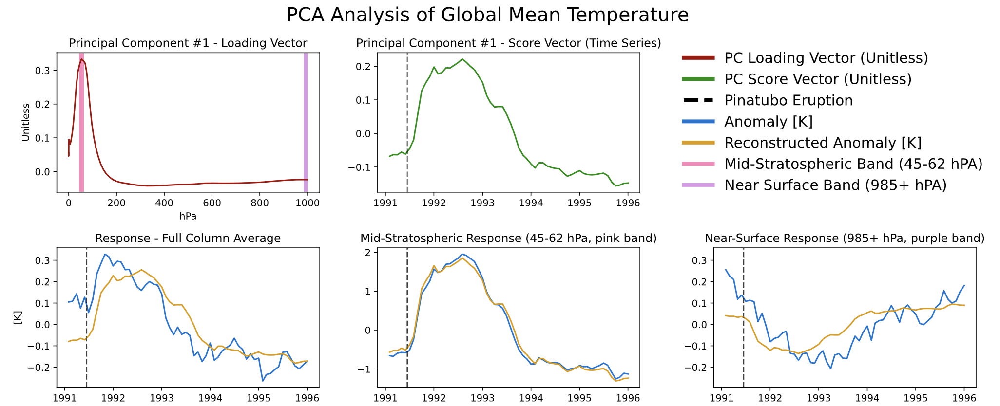
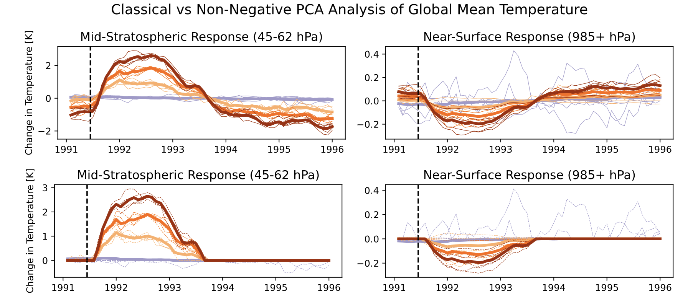
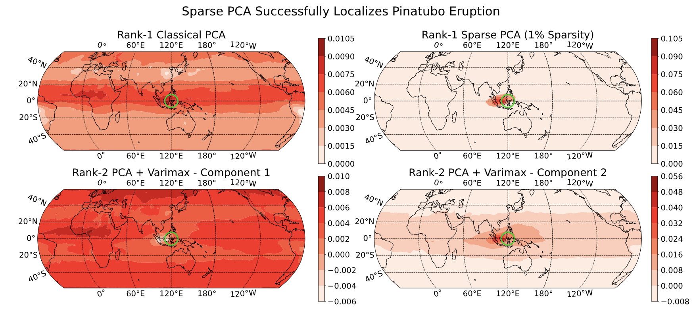
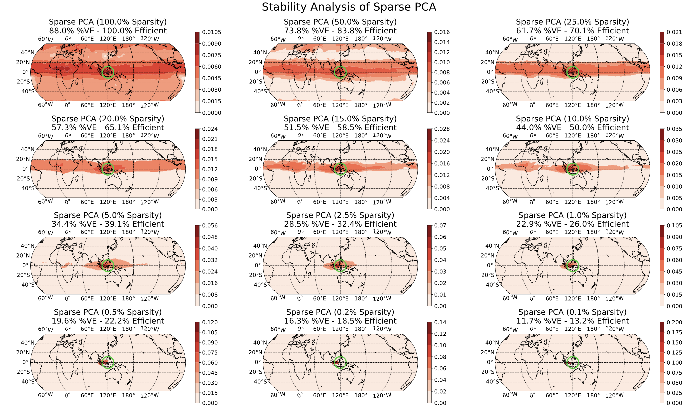



## Unsupervised Learning

```{r}
#| include: false
TRUE # To ensure knitr activates
```

Having finished our discussion of *supervised learning*, that is 
*prediction-making*, we now turn to *unsupervised learning*. Unsupervised
learning is somewhat tricky to define and it can feel like a grab-bag of random 
problems. We will make due with a definition along the lines of "finding 
patterns and structure that are likely to hold in new data". It is worth noting
what this decision _doesn't_ say: 

- *Contra* supervised learning, we don't have a special "outcome" feature. All
  features are on equal footing. 
- *Contra* reinforcement learning, we are not interacting with a world beyond
  our data. We simply have some data and hope to make a claim that will hold true
  on more data. 
- *Contra* active or online learning, we typically approach unsupervised 
  learning as a *batch* process because we are looking for patterns that hold
  in the population and aren't really well-defined on an individual level. 
  
So what are some types of unsupervised learning we might consider? We can
categorize these by the type of pattern we might hope to identify. (If you've 
taken _Multivariate Analysis_, unsupervised learning covers many of the same
aims.)

- Groups of observations. 

  There may exist a natural "grouped" structure to the data that we seek
  to find, *e.g.*, given the course schedules of many students, can we break
  them up into majors? Note that we aren't doing _classification_ here since we 
  don't know the majors: but there is an _underlying_ clustering we are backing
  our way into. Some variants: 
  
  - Hard groups: each observation belongs to one and only one group
  - Soft groups: we assign a probability of belonging to each group
  - Hierarchical: are some groups defined as subgroups of others or are the 
    groups non-overlapping
  - Outliers: does every observation belong to a group or do we allow for rare
    "weird points" that don't follow the overall pattern. 
  - Group Characterization: are the groups defined by _prototypes_ (a typical
    group member) or _archetypes_ (an exaggerated group member). *E.g.*, in a
    problem were we group cities by size and economy, NYC would be an 
    _archetype_ of our 'big, non-industrial city' group, but it is _extreme_,
    not 'average' within that group. 
    
- Patterns and Distribution Structure. 

  Can we infer something about the underlying _population_ distribution? *E.g.*
  are there consistent, but imperfect, correlations among the features 
  indicating some sort of simpler structure that we might want to capture? 
  While it is possible for students to do poorly in probability and shoot the
  lights out in inference (or *vice versa*), as a general rule students who do
  well in one class do well in the other, so we might reduce those two grades to
  a 'summary' grade. 
  
  In other contexts, we might seek to identify the parts of the sample space
  (the set of all possible outcomes) that have meaningful probability mass: 
  think of the space of all possible images. Most of the sample space is 
  just pure 'static' nonsense and the space of 'realistic' images is a small 
  subset of the sample space. Knowing this sort of 'support' is very useful in
  _denoising_ problems: given a slightly blurry image, we can estimate the 
  'closest' non-blurry image and render that instead. 
  
Over the next three weeks, we will take a quick jaunt through unsupervised 
learning: 

- Clustering
- Dimension Reduction
- Generative Models

Let's introduce these all quickly: 

- _Clustering_ is the 'grouping' task we talked about above. One way to approach
  clustering (but certainly not the only) is to find the 'high points' of the
  underlying distribution and discard the rest. Our general goal here is to
  identify groups of relatively similar observations that will re-occur 
  in new data sets. 
- _Dimension Reduction_ is the task of finding simpler 'sub-structure' within
  data. We can think of it as 'distribution compression', 'support estimation'
  (so finding the 'non-zero' parts of a distribution, not just its high points)
  or several other things. Our general goal here is to identify some sort of
  simpler structure within the underlying data distribution. 
- _Generative Modeling_: once we have used dimension reduction techniques to
  find the _chunky_ parts of the distribution, we can create new samples by 
  sampling from those chunks. 
  
A consistent challenge in unsupervised learning will be _validation_. Unlike
supervised learning, where we always had data-splitting techniques as the 
ultimate backstop for validation, unsupervised learning is not so clean. For
example, if we cluster students as above, how do we know if we did a good job?
Even if we get to see some more students, we're not really sure if our original
groups really meant anything. And the new students don't necessarily fall into
one of those original groups. (And groups might not even really exist!)

There's unfortunately no clean answer here, but there are several heuristics
that will be helpful. 

- _Stability_. Think of ways to 'shake up' the data or the modeling procedure. 
  If we get consistent results even under pertubation, our results seem to be
  a bit more reliable. (Think of the converse: if changing one point in the data
  set by just a little bit scrambles all of our findings, how much should we have
  trusted those original findings?)
  
  This of course raises some questions: 
  
  - How should we perturb our data? 
  - How can we compare the consistency of our results? 
  
  These are questions that need to be answered in the context of specific methods
  and problems. 
  
- _Robustness_. Many unsupervised learning methods have various hyperparameters
  that we need to pick. It is even harder to select these in a data-driven 
  manner, but one thing that we can always check is whether the parameter really
  matters. If our results are consistent across a wide range of hyperparameters,
  then it doesn't really matter which one we pick. (You may have seen this
  general idea in 'robustness checks' for some data analyses: if we get 
  basically the same estimated coefficient from several different model
  specifications, we don't really need to argue about which one is 'right'.)
  As with stability, 'consistency' is a problem-specific concept. 
  
  (If you want to think of robustness as a special case of stability, it's 
  entirely fair to do so.)
  
- Downstream success. Unsupervised learning is often used as a pre-processing
  step before some supervised learning task. Success on the supervised task is
  often used as semi-strong evidence that you did well on the unsupervised task.
  For example, we may want to group cancers into _sub-types_ (*e.g.*, Hodgkin 
  lymphoma and non-Hodgkin lymphoma). If our grouping enables us to provide
  a more accurate prediction of the patient's prognosis (or to provide 
  specialized treatment that leads to better outcomes), that suggests that we
  really found something meaningful in our upstream clustering. This isn't 
  always an option, but it can be quite powerful when it is.
  
## Applying Unsupervised Learning

Time allowing, let's go through some longer worked examples of unsupervised
learning from my own work. We won't focus on the _methods_ for now (though they
may look familiar from your prior coursework) but rather on the problem 
definitions and validation strategies used. 

### Clustering

In work with [John Nagorski and Genevera Allen](), I developed a new clustering
algorithm and applied it to data extracted from major speeches by US Presidents
(through the first Trump term). By _clustering_ the frequencies with which 
different presidents used different words, we were able to identify different
historical eras. 


Here, we see that the pre-20th century presidents are on the left in pink, while
the modern era presidents are on the right in green, with the transitional figures
of Woodrow Wilson and Warren G. Harding in the center in blue. This particular
method has a tuning parameter (like a lasso $\lambda$) that can be varied to
control the number of clusters, shown here on a dendrogram: 


Of course, it is interesting to know _which words_ distinguish the presidents. 
Some manual EDA suggests that some period-specific words are strong signals 
(*e.g.*, "Soviet" was not a word used by US presidents before the existence of
the USSR) and other words simply suggest a more modern orientation (*e.g.*, 
"billion" - there were not billions of people or billions of dollars in debt in
Washington's era), but a more systematic exploration could be helpful. 

Given the structure of this data, we might also want to cluster _words_ rather
than the _presidents_, so each president is a column/feature and each row is now
a word. It turns out we can actually do a form of _simultaneous_ clustering of
rows and columns resulting in something called a _cluster heatmap_: 


As before, we can vary the $\lambda$ to adjust the degree of shrinkage 
(clustering by shrinking the _distances_ _between_ points) to get fewer clusters: 


In this case, we're attempting to validate using a _robustness_ strategy. Since
the results are so stable for so much of the $\lambda$ range, we have some
confidence that our findings in that part of the result space are pretty reliable.

### Denoising + Clustering

In [work with Genevera Allen and Mitch
Rodenberry](https://michael-weylandt.com/publications/convex_wavelet_clustering.html),
I investigated the problem of separating out the different types of cells in a 
sample of brain tissue. These cells were _theoretically_ distinguishable by 
comparing the different numbers of proteins in each cell type via a technique
known as NMR spectroscopy. In practice, however, there are a few different
sources of noise we need to distinguish: 

i) the NMR spectroscopy is pretty noisy
ii) while there is an _average_ amount of proteins in each cell type, this is
    also a bit variable (some cells are simply larger than others and have more
    proteins)

We approached this problem by combining two unsupervised learning goals: 

i) _Denoising_ the NMR signal. NMR signals have certain characteristic 
   (smooth + jumpy) shapes, so we can clean up the NMR observations by removing
   noise that doesn't fit those structures
ii) _Clustering_ the protein counts. We want to identify different cell types, 
    so we wanted to _cluster_ the different measurements into similar sub-groups.
    
As with most problems, it's always good to try out your techniques in a simple
situation where we know what's going on before going to real data. We generated
three clusters defined by typical NMR signals (leftmost column) and added a 
significant amount of noise to each observation (second column). We then applied
two 'standard' clustering algorithms (third and fourth columns) and found that,
while we were _slightly_ able to separate the groups, the signals were still
far too noisy to actually make sense of them as NMR signals. (It's not just
enough to know _there are_ groups, we also want to know what major proteins 
characterize each group.) So we added a denoising step to pre-process the data
before clustering (fifth and sixth columns): here we have a much better picture
of the NMR signal (remember - these are all based on observations like the second
column!), but our signals aren't quite smooth. Finally, by putting the denoising
step _inside_ the clustering, we get the signals in the rightmost column and 
exactly recover the ground truth. 


Now that we have a working method, we applied it to actual NMR spectroscopy
yielding the following: 


This was a short paper, so we didn't go too deep into validation, but this
reflects a general statistical strategy: if we can establish that a method is
generally quite robust and reliable in very hard settings, we can hope that it
is trustworthy in less hard settings. (Note that this isn't rigorous! It's just
a hope and a prayer.)

### Dimension Reduction for Climate Data

In [work with Laura Swiler](https://michael-weylandt.com/publications/pca+.html),
we applied dimension reduction methods (variants of PCA) on atmospheric data 
following the eruption of the 1991 Mt. Pinatubo volcanic eruption. Like any 
eruption, there are many different aspects of the response: 

i) Changes over time - the largest response follows shortly after the eruption
   and it decays over time
ii) Changes over altitude - because a volcano blows a variety of aerosols into
    the atmosphere and these aerosols have different weights and chemical 
    properties, we see a difference in responses at the surface and at the
    top of the atmosphere
iii) Changes over space - while atmospheric wind patterns spread the effects
     of the eruption across the globe, not all areas have the same degree of
     impact. (In particular, east/west winds are much stronger than north/south.)
     
This data has several challenges: 

- The data is "four-dimensional" (three space dimensions + a time dimension) so
  it can't easily be placed into a standard matrix format
- The data is large enough that we need to be computationally a bit clever

Scientifically, we had two primary questions: 

- How long did the volcanic impact last? While *theoretically*, the effect will
  always exist, as a practical matter, it becomes smaller than 'climate noise'
  at some finite time.
- Where was the effect largest? This presumably tells us where the volcanic 
  eruption occurred. (This is well-known for volcanic eruptions, but point 
  sources of other climate drivers are less obvious.)
  
We first start by simply looking at the *global mean temperature*, reducing the
problem from four to two dimensions (altitude and time): 



We see different responses at the mid-stratosphere (bottom center) and 
near the Earth's surface (bottom right). As you might expect, volcanic aerosols 
in the atmosphere absorb solar radiation (and hence temperature), blocking
that same radiation from reaching the surface, resulting in a temperature
*decrease* at the surface. (In reading this plot, you can think of the blue
lines as the 'data' and the gold lines as the 'dimension reduced' pattern.)

If you note that the three gold lines are just flips and vertical stretches of 
each other and of the green line, you're ahead of the game. 

Looking more closely at those gold lines, we can see that the impact is nearly
terminated by 1994. We modified normal PCA to add a sparsity constraint to 
more rigorously identify the zone of impact. 

 

Here, we see that the estimated impact simply goes to zero and doesn't 'flip'
at the end (as we would expect from this sort of phenomenon). 

Next, turning to the spatial question, we perform a version of "3D PCA" with 
a sparsity constraint, hoping to find the area of largest impact: 


 

In the top-right panel, we see that we *almost* precisely nail the source of
the eruption (green circle). Digging more closely into this, the impact is 
actually not directly above the volcano since there were strong equatorial winds
during the eruption period, but that's beyond what we can say from just this
data alone. 

In the above image, we chose to set a sparsity level at 1% of the globe (find
the 1% area of the globe with the largest impact) but this level was a bit 
arbitrary. By varying that 1% 'knob', we can see whether our results seem 
reliable: 



Here, we see that there is *some* global impact (100% sparsity) but it is small
far from the equator; as we turn up the sparsity, our impact is increasingly
localized until we focus on the equator (recall the primary east/west winds) and
then the actual volcano region. 


  
